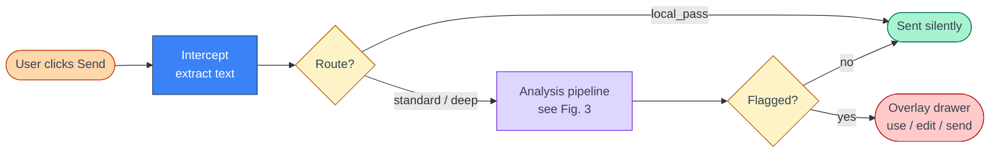
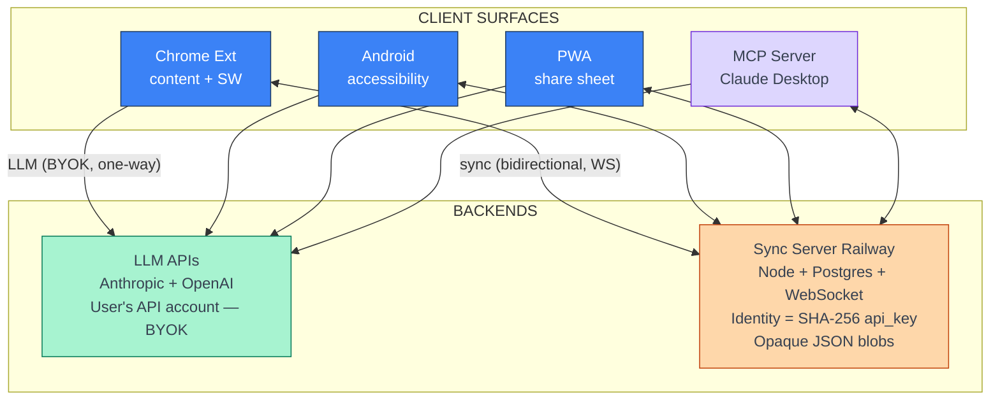
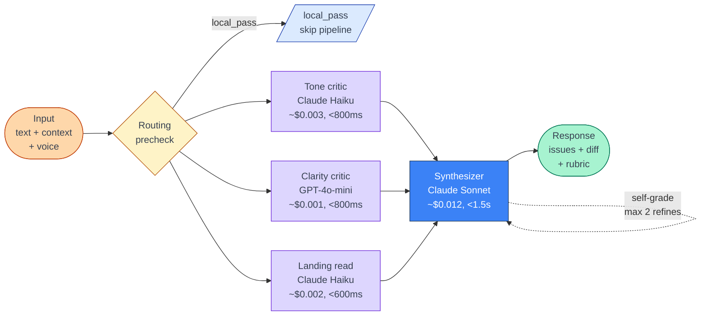

# ToneGuard — Product Requirements Document

**Version:** 1.0 (clone-team spec)
**Date:** 2026-05-22
**Status:** Reference — describes the product as if built from scratch today
**Audience:** A product + engineering team rebuilding ToneGuard from zero. Assume no access to current code; this document is sufficient to plan a build.

---

## Diagrams in this document

| # | Where | Topic |
|---|-------|-------|
| Fig. 1 | §5 | System architecture |
| Fig. 2 | §4.2 | Pre-send flow |
| Fig. 3 | §6 | Analysis pipeline |

Diagrams render inline as Mermaid. High-fidelity Excalidraw source files (with color coding and layout polish) live in [diagrams/](diagrams/) — open them in VS Code (Excalidraw extension) or at [excalidraw.com](https://excalidraw.com).

---

## 1. Product Summary

ToneGuard is a **pre-send tone safety net**. It intercepts messages a user is about to send across messaging surfaces (Slack, Gmail, LinkedIn, Android messengers, web forms) and surfaces tone, clarity, and emotional-framing risks before the message goes out. It is *not* a rewriter-by-default; it is a checker that offers a voice-preserving rewrite when something is genuinely off.

The product is built around three commitments:

1. **Voice preservation.** Suggestions should sound like the user, not like an AI assistant. The model is told to match a learned style fingerprint and only intervene when the cost of staying silent is higher than the cost of suggesting an edit.
2. **Frictionless on the green path.** If a message is fine, the user never sees ToneGuard. No nudges, no inline UI, no popups. Cost paid only when there is signal.
3. **User-owned data.** API keys, voice samples, learned preferences, and decision history are stored locally and synced across the user's own devices via an end-to-end identity hash. The product runs on the user's own LLM API account; no server-side prompt logging.

### Primary user

Knowledge workers across communication tools. The wedge is high-stakes messages: feedback to reports, escalations, customer replies, hiring/firing conversations, public posts. Secondary users include managers (where tone errors carry power-dynamic weight), customer-facing roles, neurodivergent users, and non-native speakers.

### What ToneGuard is not

- Not a grammar checker. Grammarly exists.
- Not a corporate compliance tool. There is no admin console, no DLP, no audit log.
- Not an always-on rewriter. It activates only when something is flagged.
- Not a coaching app. Education is a side effect, not the primary surface.

---

## 2. Jobs To Be Done

| # | When... | I want to... | So that... |
|---|---------|--------------|------------|
| 1 | I'm about to send a tense message | catch passive-aggression, guilt-trips, or defensive framing I didn't notice | I don't damage a relationship or look unprofessional |
| 2 | I write a long reply on autopilot | see if it's clearer than it needs to be | the reader actually reads it |
| 3 | I'm responding to a difficult coworker | get help calibrating tone without losing my voice | I sound like myself, just better |
| 4 | I write to my manager vs. a peer vs. a customer | apply different strictness per context | the same checker isn't too soft in Slack and too aggressive in Gmail |
| 5 | I've trained ToneGuard on my writing | trust that suggestions match my style | I don't have to rewrite the rewrite |
| 6 | I work across laptop, phone, and Android | have my preferences and learning follow me | I don't retrain on every device |

---

## 3. Personas

### Maya — Engineering Manager (primary)
Writes 50+ Slack messages, 10 emails, and 2 difficult 1:1 messages a day. Has been told her tone reads as "blunt." Doesn't want to soften everything — wants a second pair of eyes on the messages that actually matter.

### Devin — Customer Success Lead (secondary)
Replies to angry customers. Has a template library but knows templates feel canned. Needs a tone check that preserves warmth without sliding into deference.

### Sam — Senior IC, non-native English (tertiary)
Strong technically, less confident about register and idiom. Wants a coach that doesn't make every message sound generic-American.

---

## 4. Core User Flows

### 4.1 First-run onboarding (Chrome extension)
1. User installs from Chrome Web Store.
2. Welcome page opens automatically: explains the model (BYOK — bring your own API key), privacy stance, and one-time setup.
3. User pastes Anthropic API key. Key is stored in `chrome.storage.sync` (synced across the user's Chrome profile, never sent to ToneGuard servers).
4. Optional: user pastes 3+ writing samples to train a voice fingerprint. Skippable.
5. Default intent mode (Professional), default strictness (Balanced), default site list (Slack, Gmail, LinkedIn) are pre-set.
6. User is taken to a live Slack/Gmail tab to try a flagged message.

### 4.2 Pre-send interception (the green path)

**Figure 2 — Pre-send flow** ([Excalidraw source](diagrams/presend-flow.excalidraw))



1. User types a message in a supported surface and clicks Send (or Cmd-Enter).
2. Content script intercepts the send. Text is extracted from the editable element.
3. **Local precheck**: trivial messages ("ok", "thanks", <5 words) skip the model entirely (`routing: local_pass`).
4. Otherwise, the service worker calls the analysis pipeline (see §6) and waits up to 3 seconds.
5. **Unflagged path**: send proceeds normally. User sees nothing. Total user-perceived latency target: <1.2s p50, <3s p95.
6. **Flagged path**: send is blocked; overlay drawer appears with diagnosis and suggestion (see §4.3).
7. **Error path**: if analysis fails, the user sees an inline non-blocking banner ("ToneGuard couldn't check — sent as-is" OR "blocked: tap to retry", depending on user setting). Default is fail-open with banner.

### 4.3 Flagged-message overlay
The overlay drawer shows, in order:
1. **One-line landing read** — "Reads as: defensive, deflecting blame" (the *landing* critic; see §6.4).
2. **Issue cards** — each card has: rule violated, exact quoted phrase from the message, plain-language explanation. Maximum 3 cards shown; more available via "show all."
3. **Suggested rewrite** — with word-level diff (added text green, removed text strikethrough red).
4. **Three actions**:
   - **Use suggestion** — replaces text in the editable, refocuses send.
   - **Send as-is** — dismisses overlay, sends original. Decision logged to learning store.
   - **Edit suggestion** — opens an inline editor with the rewrite pre-filled.
5. **Meta footer** — confidence (low/med/high), intent mode used, "Why this rule?" expandable.

### 4.4 Mobile share-sheet flow (PWA)
1. User selects text in any Android app.
2. Share → ToneGuard.
3. PWA opens, shows the same overlay as desktop (landing read + issue cards + suggestion).
4. User taps "Copy suggestion" → switches back to original app → pastes.
5. Decision is logged and synced.

### 4.5 In-app keyboard interception (Android native)
1. Android accessibility service watches supported apps (Messages, Gmail, Slack, WhatsApp, Discord, Teams, etc.).
2. On send-button tap, service extracts text from the active editable.
3. Same analysis pipeline runs.
4. Flagged messages surface in a floating overlay above the keyboard with the same three actions.

### 4.6 Voice training
1. User opens options page → "Train voice."
2. Pastes 3-15 message samples (own past writing).
3. On save, fingerprint is regenerated: a Sonnet call produces a ~200-token markdown profile (tone defaults, preferred phrasings, avoided phrasings, formality register, opening/closing patterns).
4. Future analyses include the fingerprint in the synthesizer prompt.
5. ToneGuard also passively collects accepted suggestions and unflagged user-written messages as "auto samples" (capped at 30). Trained samples are preferred; auto samples are fallback.

---

## 5. System Architecture

ToneGuard is a constellation of clients around a shared sync backbone. The LLM calls themselves are stateless and run on the user's API account.

**Figure 1 — System architecture** ([Excalidraw source](diagrams/architecture.excalidraw))



Four client surfaces (Chrome extension, Android, PWA, MCP server) talk to two backends: LLM APIs (one-way, BYOK — the user's own Anthropic + OpenAI accounts) and the Railway sync server (bidirectional, WebSocket-backed). The sync server stores opaque JSON keyed by `SHA-256(api_key)` and never sees prompt content.

### 5.1 Surfaces (clients)

| Surface | Role | Auth | Storage |
|---------|------|------|---------|
| Chrome extension | Primary surface. Intercepts sends on web. | User's Anthropic key, stored in `chrome.storage.sync` | `chrome.storage.local` for decisions, voice samples; `.sync` for settings |
| MCP server | Optional. Exposes analysis as MCP tools so Claude Desktop / Cursor can call ToneGuard. | Env vars (`ANTHROPIC_API_KEY`, `OPENAI_API_KEY`) | `~/.toneguard/learning.json` |
| Android app | Native Kotlin. Accessibility service watches messaging apps. | User key, encrypted in Android Keystore | Room DB + sync |
| PWA | Share-sheet entry for any mobile app. | User key in `localStorage` | `localStorage` + sync |
| Sync server | Stateless relay. Stores opaque blobs keyed by user-hash. | JWT (HS256, 1hr); identity = SHA-256 of API key | Postgres single-table |

### 5.2 The dual code path (critical design constraint)

Prompts and behaviors live in **two places** that must be kept in sync:

- **MCP path**: `toneguard-mcp/critics/*.md` and `analyzer.py`
- **Direct-API path**: `prompts/base.txt`, `prompts/landing.txt`, plus inline constants in `service-worker.js` (e.g. `LANDING_SYSTEM_PROMPT`, `BASE_PROMPT`)

Reason: the Chrome extension cannot call a Python MCP server from a service worker, so it speaks Anthropic's HTTP API directly. The MCP server uses the same prompts for desktop integrations.

**Build rule:** the canonical source lives in `shared/` (or `toneguard-mcp/critics/`); both paths read or build from it. CI verifies no drift.

---

## 6. Analysis Pipeline

A single analysis is a 3-or-4-stage cascade.

**Figure 3 — Analysis pipeline** ([Excalidraw source](diagrams/analysis-pipeline.excalidraw))



Input → routing precheck (either short-circuits to `local_pass` or fans out to three parallel model calls: Haiku tone critic, GPT-4o-mini clarity critic, Haiku landing read) → converges into the Sonnet synthesizer → structured response. The self-grading loop refines up to 2 passes if any rubric dimension grades below B.

### 6.1 Inputs

```
{
  text:            string,
  context: {
    surface:       "slack" | "gmail" | "linkedin" | "android-messages" | ...,
    thread:        optional last N messages for context,
    relationship:  optional {mention, frequency, last_seen} from learning store,
    intent_mode:   "professional" | "warm" | "direct" | "deescalating" | "boundary" | "concise",
    voice_strength:"preserve" | "balanced" | "polish" | "rewrite",
    strictness:    "gentle" | "balanced" | "strict",
    custom_rules:  string (user free-text),
  },
  voice: {
    fingerprint:   optional ~200-token markdown profile,
    samples:       optional up to 5 raw text samples (trained-preferred),
  },
  learned: {
    examples:      optional past flagged/accepted pairs,
  }
}
```

### 6.2 Routing precheck (local, no model)

| Route | Condition | Behavior |
|-------|-----------|----------|
| `local_pass` | <5 words, or matches greeting/acknowledgment whitelist | Skip pipeline entirely. Return `{flagged: false, routing: "local_pass"}`. |
| `blocked_error` | API key missing, model unreachable after retries | Return `{flagged: false, error: "...", routing: "blocked_error"}`. Surface to user. |
| `deep` | Contains escalation triggers ("per my last email", "as I said before"), or intent mode is `deescalating`/`boundary` | Use deeper synthesizer pass with extra critic context. |
| `standard` | Everything else | Default path. |

### 6.3 Critics (parallel)

Two critics run in parallel, each producing structured findings.

**Claude Haiku — tone critic** (`critics/claude-tone.md`)
- Looks for: passive-aggression, guilt-trips, defensive framing, emotional manipulation, unclear boundaries, overcommunication, ALL-CAPS shouting, "per my last email" energy.
- Returns: `[{rule, quote, explanation, severity}]`.
- Model: `claude-haiku-4-5-20251001`. Budget: ~512 output tokens.

**GPT-4o-mini — clarity critic** (`critics/gpt-tone.md`)
- Looks for: wordiness, weak openings ("I just wanted to..."), hedging, run-on sentences, passive voice where active is clearer, filler phrases, inconsistent register.
- Returns: same shape as tone critic.
- Why a different vendor: diversity of failure modes. Two models trained differently catch different issues; ensembling reduces both false positives and false negatives.

### 6.4 Landing critic (Haiku, parallel)
A one-shot Haiku call (`critics/landing.md`) that reads the message as a recipient on a single skim and returns:
```
{ takeaway: string, tone_felt: string, next_action: string }
```
This is shown at the top of the overlay so the user sees how their message *lands* before they see what to fix. Cheap (~$0.002).

### 6.5 Synthesizer (Sonnet)
Inputs: original text, both critics' findings, landing read, voice fingerprint, intent mode, strictness, custom rules.

Output (`docs/analysis-contract.md`):
```
{
  flagged:          bool,
  confidence:       "low" | "medium" | "high",
  routing:          "local_pass" | "standard" | "deep" | "blocked_error",
  intent_mode:      string,
  voice: {
    strength:       string,
    source:         "fingerprint" | "samples" | "none",
    voice_fidelity: 0-100,
  },
  issues: [
    { rule, quote, explanation, severity }
  ],
  suggestion:       string,            // the rewrite
  diff: [
    { op: "keep"|"add"|"remove", text }
  ],
  landing: {
    takeaway, tone_felt, next_action
  },
  rubric: {
    tone, clarity, brevity, empathy, directness, voice_fidelity   // 0-100 each, with letter grade
  },
  reasoning:        string,            // short, user-facing
}
```

Model: `claude-sonnet-4-20250514`.

### 6.6 Self-grading loop
If any rubric dimension grades below B (score < 83), the synthesizer is re-run once with the previous output + critique appended. Maximum 2 refinement passes. Final result includes `refinement_passes` and `grade_history`.

### 6.7 Cost & latency budget

| Pass | Model | Latency target | Cost |
|------|-------|----------------|------|
| Tone critic | Haiku | <800ms | ~$0.003 |
| Clarity critic | GPT-4o-mini | <800ms (parallel) | ~$0.001 |
| Landing | Haiku | <600ms (parallel) | ~$0.002 |
| Synthesizer | Sonnet | <1500ms | ~$0.012 |
| **Total p50** | — | **~2.1s** | **~$0.018** |

Target: 90% of analyses complete in <3s end-to-end. Cost target: <$0.02 per analysis.

---

## 7. Voice Fingerprint System

The fingerprint is the centerpiece of "voice preservation."

### 7.1 What it captures
A ~200-token markdown block with five sections:
1. **Tone defaults** — typical register, warmth, formality.
2. **Preferred phrasings** — words/constructions the user actually uses.
3. **Avoided phrasings** — words/constructions the user notably does not use.
4. **Formality register** — when they shift up or down.
5. **Opening/closing patterns** — how they start and end messages.

### 7.2 Inputs
- Trained samples (user-pasted): max 15.
- Auto samples (passively collected accepted messages): max 30.
- Min 3 samples required to generate a fingerprint.

### 7.3 Regeneration
- Triggered manually from options page, or automatically when the trained-sample set changes by ≥2 items.
- Sonnet call with all available trained samples (auto used as fallback).
- ~$0.01 per regen.

### 7.4 Use in analysis
Preference order in the synthesizer prompt:
1. Fingerprint (if exists and ≥3 trained samples backing it).
2. Raw samples (up to 5, trained-first).
3. No voice context (synthesizer uses intent mode only).

### 7.5 Voice strength dial
Independent of fingerprint quality:
- **Preserve** — minimal edits; rewrite only when problem is severe.
- **Balanced** — default.
- **Polish** — moderate rewrite, still match voice.
- **Rewrite** — full restructure permitted.

---

## 8. Settings & Configuration

### 8.1 User-facing knobs
| Setting | Storage | Default | Notes |
|---------|---------|---------|-------|
| Enable / disable | sync | enabled | Master kill switch. |
| API key | sync | — | Required. |
| Intent mode (default) | sync | professional | Per-message override available. |
| Voice strength | sync | balanced | |
| Strictness (default) | sync | balanced | |
| Strictness (per site) | sync | — | E.g. Slack: strict, Gmail: gentle. |
| Custom rules | sync | "" | Plain text, appended to synthesizer prompt. |
| Active sites | sync | Slack, Gmail, LinkedIn | Add custom domains; requires user grant of host permission. |
| Trained voice samples | local | [] | Capped 15. |
| Fail-open vs fail-closed | sync | fail-open | On model error, send anyway with banner. |

### 8.2 No telemetry opt-in/out
Telemetry is local-only by design (see §10). No server-side analytics exist, so there's nothing to opt out of.

---

## 9. Sync Protocol

### 9.1 Identity model
- Identity = SHA-256(user's API key), hex-encoded. Computed client-side.
- Sync server never sees the raw API key. It cannot decrypt user data because there isn't any — it stores opaque JSON blobs.
- If the user rotates their API key, they lose sync continuity (acceptable trade-off; the alternative is a separate ToneGuard account, which we explicitly reject).

### 9.2 Endpoints
```
POST /auth         { hash }                           → { token }     # JWT, 1hr, HS256
GET  /sync         (Authorization: Bearer)           → [{data_type, payload, version, updated_at}]
POST /sync         (Bearer) { data_type, payload, version } → { ok, version }
GET  /ws?token=    (websocket upgrade)
GET  /healthz                                         → { ok: true }
```

WebSocket events: `{ event: "UPDATE", data_type, payload, version, updated_at }`. Broadcast to all subscribers of a given `user_hash`.

### 9.3 Data types synced
- `decisions` — accepted/dismissed/edited history (powers learned examples).
- `voice_samples`, `voice_fingerprint`.
- `relationships` — mention frequency map.
- `custom_rules`.
- `stats_history` — 12-week rolling summary.

### 9.4 Conflict resolution
Last-writer-wins by `(version, updated_at)`. For list-shaped data (decisions, samples), clients merge by stable ID and prefer the highest-version write. Merge logic is identical across all four clients.

### 9.5 Schema
Single table:
```sql
CREATE TABLE sync_data (
  user_hash    TEXT NOT NULL,
  data_type    TEXT NOT NULL,
  payload      JSONB NOT NULL,
  version      INT NOT NULL,
  updated_at   TIMESTAMPTZ DEFAULT now(),
  PRIMARY KEY (user_hash, data_type)
);
```

### 9.6 Sync server URL
Hardcoded in all four clients. Migration requires a coordinated bump (Chrome ext store review, Android Play release, PWA cache flush, MCP package version). This is intentional friction: the server URL changes rarely (target: never after 1.0).

---

## 10. Privacy & Data Stance

1. **BYOK.** All LLM calls hit the user's own API account. ToneGuard never sees prompt content.
2. **Identity is a hash.** Sync server has no email, no name, no account. Just an opaque hash and JSON blobs.
3. **Local-first learning.** Decisions, samples, fingerprints, and relationship data live on-device. Sync is opt-in (default on, but disablable per data type).
4. **No telemetry off-device.** A local telemetry log tracks event counts (analyses run, flags shown, suggestions accepted, latency buckets). It never leaves the device. The options page lets the user view the log and copy a redacted summary to paste into a bug report.
5. **No prompt logging.** The Anthropic and OpenAI calls go directly from the user's client to those vendors. ToneGuard's own infra never sees the message content.
6. **Right to delete.** "Wipe all data" button in options: clears local storage and pushes empty payloads for every `data_type` to the sync server.

---

## 11. Error Handling Principles

1. **Never silently release a flagged message.** If the model returns malformed JSON or errors, the user sees a banner with a diagnostic code. The send is NOT auto-released as if the check passed.
2. **Fail-open vs fail-closed is a user choice.** Default is fail-open (send proceeds with a banner) because most users prefer continuity. Fail-closed (block until retry succeeds) is available.
3. **Surface error codes.** Every failure has a stable, grep-able code (`E_API_KEY_MISSING`, `E_MODEL_5XX`, `E_PARSE_INVALID_JSON`, `E_TIMEOUT`). Codes are user-visible and link to a troubleshooting page.
4. **Retry transient failures.** 429 and 5xx get exponential backoff (3 retries, jitter, capped at 4s total).
5. **Diagnostic mode.** A toggle in options enables `[ToneGuard:diag]`-prefixed console logs on the critical path. Off by default.

---

## 12. Telemetry (Local-Only)

Events recorded to a local log (schema in `shared/telemetry/schema.json`):

| Event | Payload |
|-------|---------|
| `analysis_run` | routing, latency_bucket, flagged, cost_est |
| `analysis_failed` | error_code, latency_bucket |
| `suggestion_accepted` | issue_count, voice_fidelity |
| `suggestion_dismissed` | issue_count |
| `suggestion_edited` | issue_count, edit_distance_bucket |
| `voice_trained` | sample_count |
| `fingerprint_regenerated` | sample_count, latency_bucket |

Users see a weekly summary in the popup ("This week: 42 messages checked, 7 flagged, 6 accepted").

---

## 13. Success Metrics

### 13.1 Product-level (user, not server, since we have no server telemetry)
- **Acceptance rate** — % of flagged messages where the user takes the suggestion (target: >55%).
- **Edit-then-send rate** — % where the user edits the suggestion (target: 15-25% — too low means suggestions are good or users disengaged; too high means suggestions aren't useful).
- **Dismiss rate** — % where the user sends as-is (target: <30%).
- **False-flag complaint rate** — qualitative; from feedback channel.
- **Retention** — 30/60/90-day install retention. Target: 40% / 30% / 25%.

### 13.2 Performance
- p50 latency <1.2s, p95 <3s, p99 <5s end-to-end.
- Cost <$0.02 per analysis (median user: <$3/month).
- Sync push-to-pull latency <2s over WebSocket.

### 13.3 Reliability
- Analysis success rate >99% (excluding user API key issues).
- Crash rate <0.1% of sessions.
- Sync availability >99.5%.

---

## 14. Roadmap (post-1.0)

### Near-term (3 months)
- **Reply-aware analysis.** Pull the thread's last 1-3 messages as context.
- **Tone calibration per relationship.** Auto-learn that "messages to @maya" should be warmer than "messages to @ceo."
- **Slack-native app.** Use Slack's send-shortcut API instead of content-script interception.

### Mid-term (6 months)
- **iOS app + keyboard extension.**
- **Outlook desktop add-in.**
- **Team accounts** (optional) — shared custom rules across a small org, opt-in.

### Speculative
- **Voice/audio mode** — pre-call coaching for tone in a Zoom prep window.
- **Async writing coach** — weekly digest of patterns ("you hedge 3x more in Slack than email").

Explicitly **out of scope** for v1.0: admin consoles, DLP integration, enterprise SSO, message archival.

---

## 15. Open Questions

1. **Default fail-mode.** Fail-open ships fastest but risks "ToneGuard didn't catch this" complaints. Should the default flip after onboarding completes?
2. **Sample collection consent.** Auto-collecting accepted messages as voice samples is powerful but feels surveilly. Should we require explicit opt-in after first 10 accepts?
3. **Critic ensemble economics.** Two critics + synthesizer is ~3x the cost of a single-model approach. Is the quality lift worth it, or can a stronger single Sonnet call replace the ensemble at half the cost?
4. **Mobile differentiation.** Does the Android accessibility service create enough value to justify ongoing maintenance, or is PWA-only sufficient?
5. **Sync identity recovery.** API-key-rotation loses sync. Is a soft recovery flow (re-import from one device) worth the complexity?

---

## 16. Appendix: Glossary

- **Critic** — a single LLM call that returns structured findings about one dimension (tone, clarity, landing).
- **Synthesizer** — the Sonnet call that merges critic outputs into a single user-facing response with rewrite + diff.
- **Landing** — how a message reads on first skim; what the recipient takes away.
- **Voice fingerprint** — compressed style profile derived from user samples.
- **Routing** — pre-model decision about which pipeline path to take.
- **Intent mode** — the tonal goal of a specific message (professional, warm, direct, de-escalating, boundary, concise).
- **Voice strength** — how aggressively the rewrite is permitted to deviate from the original.
- **Strictness** — how readily ToneGuard flags borderline cases. Per-site overridable.
- **BYOK** — bring your own (LLM API) key.

---

*End of document.*
